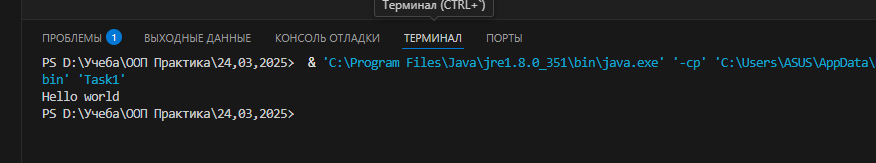

# ООП Практика - Без'язичний Ростислав

## Загальна інформація

  - **Студент:** Без'язичний Ростислав
  - **Група:** 34 група
  - **Підгрупа:** 2 Підгрупа (Зелінська А.О.)
  - **Мова програмування:** Java

## Головна сторінка

### Завдання 1 (24.03.2025)

Вам потрібно виконати наступне:
1. Підготувати сховище до розміщення проекту
2. Написати просту консольну програму (наприклад вивід на екран аргументів командної строки)
3. Прикріпити посилання на GIT та архівований проект

Результат:

### Завдання 2 (25.03.2025)

Вам потрібно виконати наступне:
1. Розробити клас, що серіалізується, для зберігання параметрів і результатів
обчислень.
Використовуючи агрегування, розробити клас для знаходження рішення
задачі. 
2. Розробити клас для демонстрації в діалоговому режимі збереження та
відновлення стану об'єкта, використовуючи серіалізацію. Показати особливості
використання transient полів. 
3. Розробити клас для тестування коректності результатів обчислень та
серіалізації/десеріалізації.
Використовувати докладні коментарі для автоматичної генерації
документації засобами javadoc.
4. Виконати індивідуальне завдання згідно номеру в списку.
  - 21 Визначити двійкове уявлення цілої та дробової частини речового
десяткового числа.

Результат:

