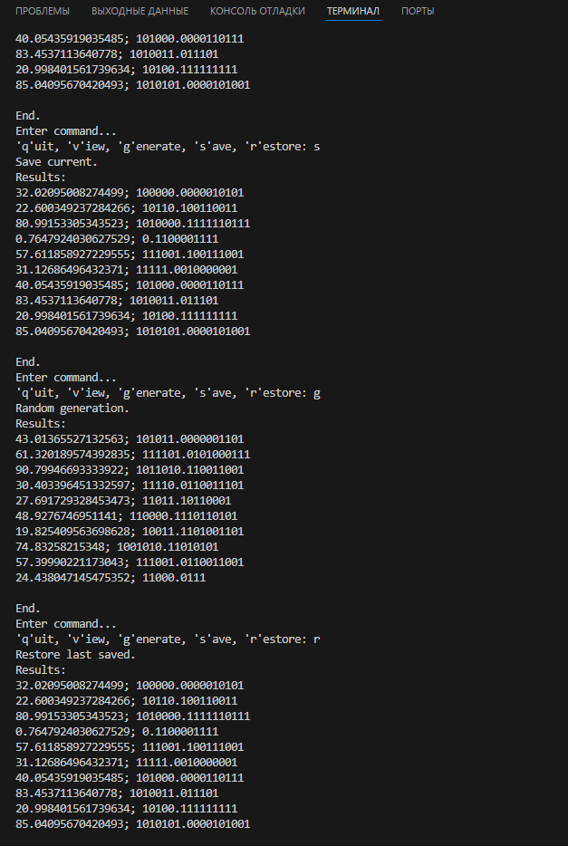
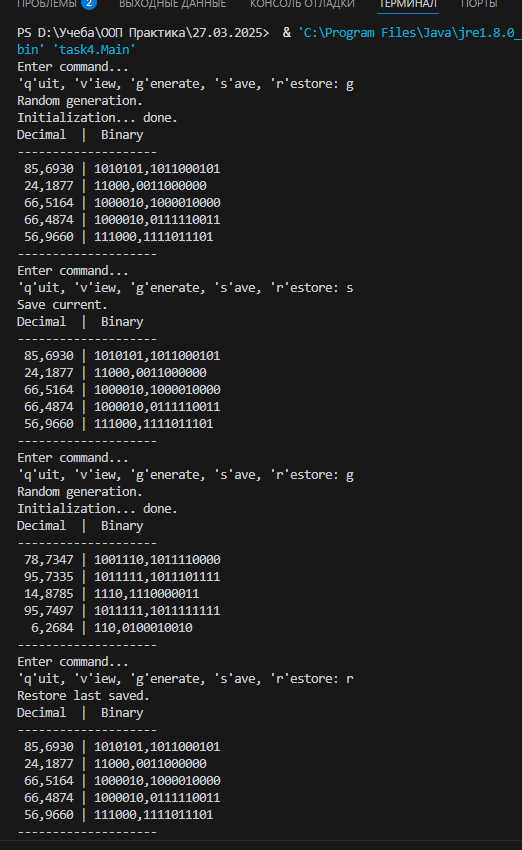
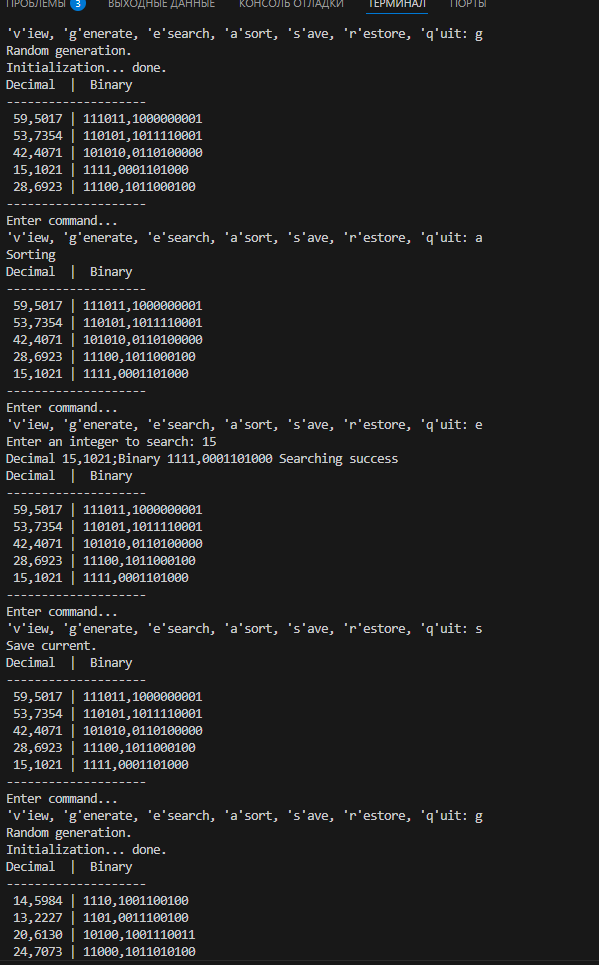
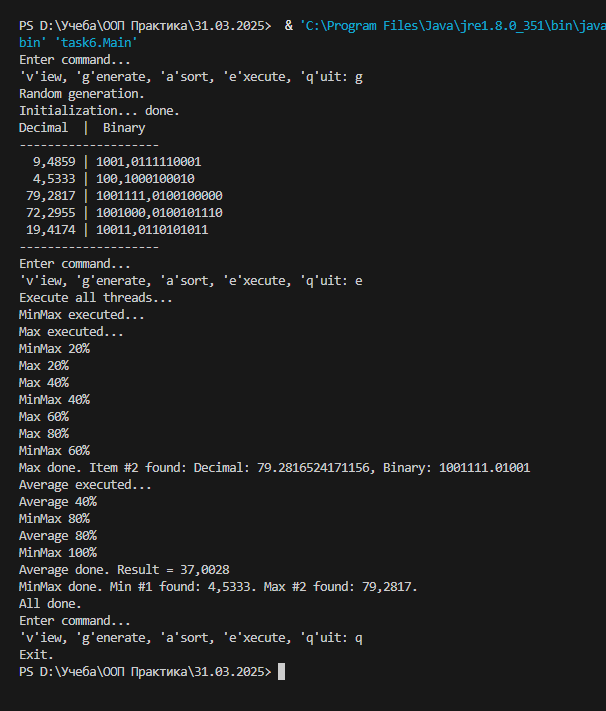

# ООП Практика - Без'язичний Ростислав

## Загальна інформація

  - **Студент:** Без'язичний Ростислав
  - **Група:** 34 група
  - **Підгрупа:** 2 Підгрупа (Зелінська А.О.)
  - **Мова програмування:** Java

## Головна сторінка

### Завдання 1 - Вступ (24.03.2025)

Вам потрібно виконати наступне:
1. Підготувати сховище до розміщення проекту
2. Написати просту консольну програму (наприклад вивід на екран аргументів командної строки)
3. Прикріпити посилання на GIT та архівований проект

Результат:

### Завдання 2 - Класи та об'єкти (25.03.25)

Вам потрібно виконати наступне:
1. Розробити клас, що серіалізується, для зберігання параметрів і результатів
обчислень.
Використовуючи агрегування, розробити клас для знаходження рішення
задачі. 
2. Розробити клас для демонстрації в діалоговому режимі збереження та
відновлення стану об'єкта, використовуючи серіалізацію. Показати особливості
використання transient полів. 
3. Розробити клас для тестування коректності результатів обчислень та
серіалізації/десеріалізації.
Використовувати докладні коментарі для автоматичної генерації
документації засобами javadoc.
4. Виконати індивідуальне завдання згідно номеру в списку.
  - 21 Визначити двійкове уявлення цілої та дробової частини речового
десяткового числа.

Результат:

### Завдання 3 - Спадкування (26.03.25)

Вам потрібно виконати наступне:
1. Як основа використовувати вихідний текст проекту попередньої лабораторної роботи. Забезпечити розміщення результатів обчислень уколекції з можливістю збереження/відновлення.
2. Використовуючи шаблон проектування Factory Method (Virtual Constructor), розробити ієрархію, що передбачає розширення рахунок додавання
нових відображуваних класів.
3. Розширити ієрархію інтерфейсом "фабрикованих" об'єктів, що представляє набір методів для відображення результатів обчислень.
4. Реалізувати ці методи виведення результатів у текстовому виде.
5. Розробити тареалізувати інтерфейс для "фабрикуючого" методу.

Результат:

### Завдання 4 - Поліморфізм (27.03.25)

Вам потрібно виконати наступне:
1. За основу використовувати вихідний текст проекту попередньої лабораторної роботи Використовуючи шаблон проектування Factory Method
(Virtual Constructor), розширити ієрархію похідними класами, реалізують методи для подання результатів у вигляді текстової
таблиці. Параметри відображення таблиці мають визначатися користувачем.
2. Продемонструвати заміщення (перевизначення, overriding), поєднання (перевантаження, overloading), динамічне призначення методів
(Пізнє зв'язування, поліморфізм, dynamic method dispatch).
3. Забезпечити діалоговий інтерфейс із користувачем.
4. Розробити клас для тестування основної функціональності.
5. Використати коментарі для автоматичної генерації документації засобами javadoc.

Результат:

### Завдання 5 - Обробка колекцій (28.03.25)

Вам потрібно виконати наступне:
1. Реалізувати можливість скасування (undo) операцій (команд).
2. Продемонструвати поняття "макрокоманда"
3. При розробці програми використовувати шаблон Singletone.
4. Забезпечити діалоговий інтерфейс із користувачем.
5. Розробити клас для тестування функціональності програми.

Результат:

### Завдання 6 - Паралельне виконання (31.03.25)

Вам потрібно виконати наступне:
1. Продемонструвати можливість паралельної обробки елементів колекції (пошук мінімуму, максимуму, обчислення середнього значення, відбір за критерієм, статистична обробка тощо).
2. Управління чергою завдань (команд) реалізувати за допомогою шаблону Worker Thread.

Результат:

